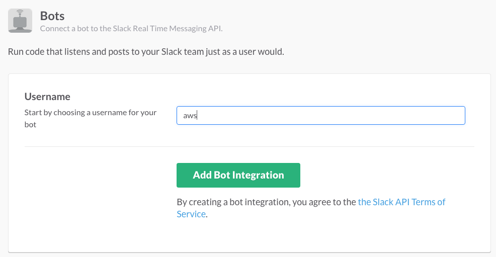

## Installation

Create a new Bot Integration under [services/new/bot](http://slack.com/services/new/bot).



On the next screen, note the API token.

## Deploy SlackGoogleBot

[](https://heroku.com/deploy?template=https://github.com/dblock/slack-google-bot/tree/master)

### Environment

#### SLACK_API_TOKEN

Set SLACK_API_TOKEN from the Bot integration settings on Slack.

```
heroku config:add SLACK_API_TOKEN=...
```

#### GOOGLE_API_KEY

A required API key from https://console.developers.google.com/apis. You must create a new API project for _Google Custom Search_ and add credentials.

#### GOOGLE_CSE_ID

Optional Google Custom Search ID from https://cse.google.com/cse. When set the custom search engine will be used instead of Google Web Search.

#### GIPHY_API_KEY

SlackGoogleBot replies with animated GIFs. While it's currently not necessary, you may need to set GIPHY_API_KEY in the future, see [github.com/Giphy/GiphyAPI](https://github.com/Giphy/GiphyAPI) for details.

### Heroku Idling

Heroku free tier applications will idle. Either pay 7$ a month for the hobby dyno or use [UptimeRobot](http://uptimerobot.com) or similar to prevent your instance from sleeping or pay for a production dyno.
